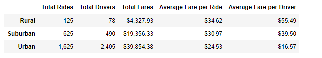
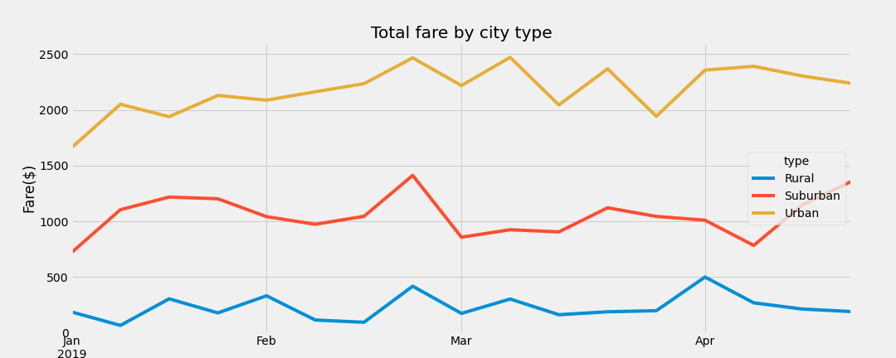

# PyBer_Analysis

## Project Overview
The customer has asked me to provide a summary data frame of the ride-sharing data by city type. The key ask here is to create a multiple-line graph that shows the total weekly fares for each city type. Based on these 2 reports the customer wants to know summarizes how the data differs by city type and propose how those differences can be used by decision-makers at PyBer.
## Resources
•	Data Source: city_data.csv and ride_data.csv
•	Software: Python 3.6.7
•	Anaconda Jupyter 4.7.12
## Results
1.	The summary data frame shows that the rural cities have the highest average fare per ride and per driver owing to the least driver count and rides on the contrary to Urban cities where the average fare per ride and per driver is the least among the 3 types. 

2.	The total drivers in the urban type are way more than the total rides happening in this type. As for the other 2 city types the total drives are less than the total rides.  
3.	As per the multiple-line chart Urban cities are generating highest Total fare among the 3 types followed by Suburban and then by rural being the least

## Summary
Based on the results here are the recommendations to the CEO for addressing any disparities among the city types.
•	Its evident from the graph that the total rural fare is not even half for the other 2 so it means the rural population prefer their own vehicles over calling a pyber. In such scenario Pyber need not focus on growing rides or drivers in rural cities.
•	Since the Total fare in urban cities is the highest Pyber can study the trends towards amongst urban population to help them bring down the average fare per ride by implementing smart programs like ride share or similar ones to stay on top with the competition
•	Suburban cities are mostly residential areas. Here though the Total Fares is not as high as urban but still there is room for improvement. Since there are far more drivers in urban areas as compared to rides that happen there Pyber can divert some of its driver strength to the suburban cities and bring down the Average fare per ride and per driver to attract more customers. 
